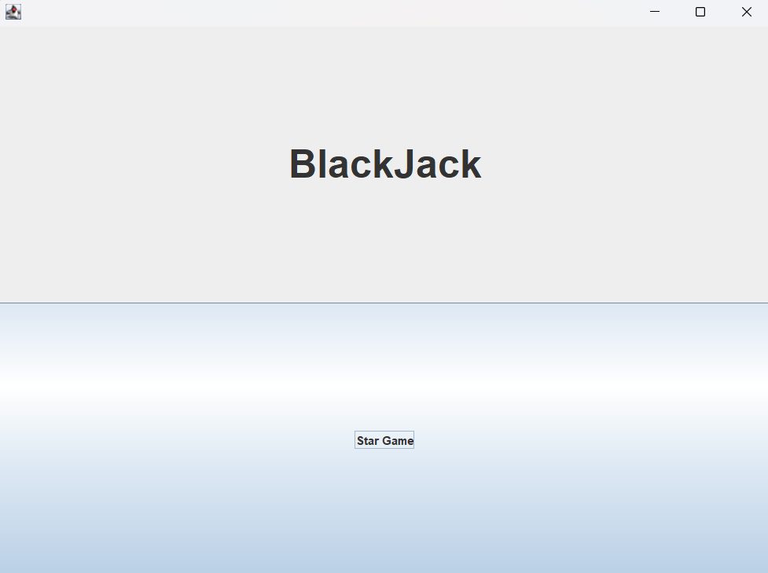
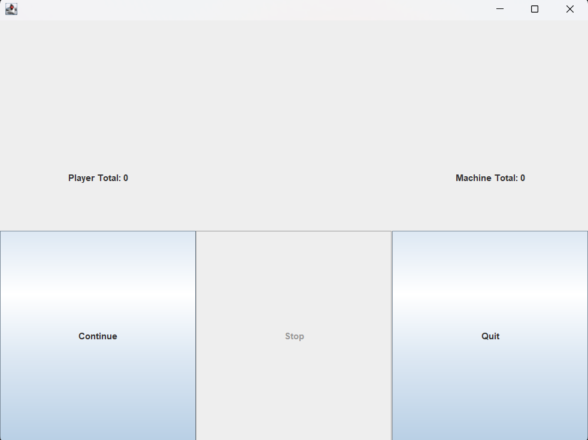
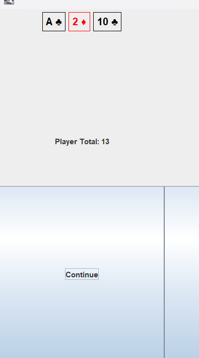
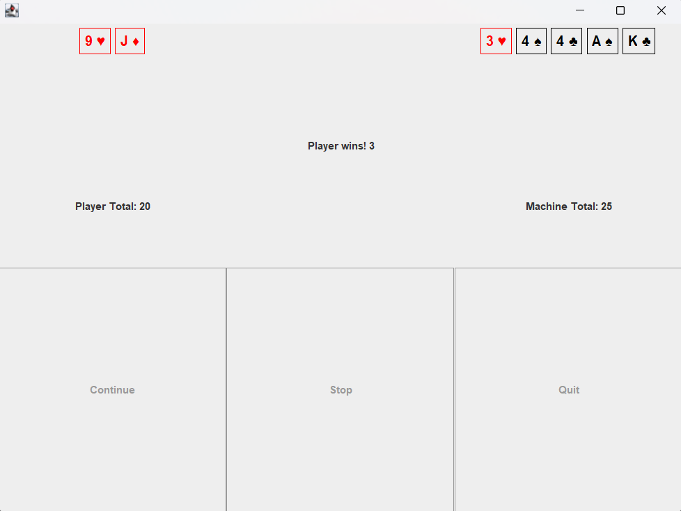

<h1>Project Java BlackJack</h1>

***

<h2>***BlackJack:***</h2>

In this version of the game you must take cards from the deck and have
the total the closest as possible of 21. you must have more than 21 in total,
you will lose otherwise.

When you're done take cards, its time for the machine to take cards.
The machine also cant have more than 21 cards or it loses. When its total
is bigger than 17, its forced to stop taking cards.

When both the player and the machine are done taking cards, the game calculates
the winner. The one that have total closer from 21 wins. If both have the same
total thats a draw.

***

<h2>***How to play:***</h2>

Open the file Project-Java_BlackJack.jar to start the game.

Once the game is open, click on Start Game to begin playing.

Its your turn, click on Continue to take as many cards as you want.
Be carafull not to have more than 21 as total, or you will lose.

Whenever you feel ready to stop, click Stop to pass the turn to the machine.
The buttons will block and the machine will start taking cards.

The machine stop taking cards as soon as its total is bigger than 17.
If it have more thans 21 as total it loses, if not, the game calculates
who have the total closer to 21 and shows the winner. If both have the same
the result is a draw.

When the game is over it reset to initial configuration, ready for another
game.

