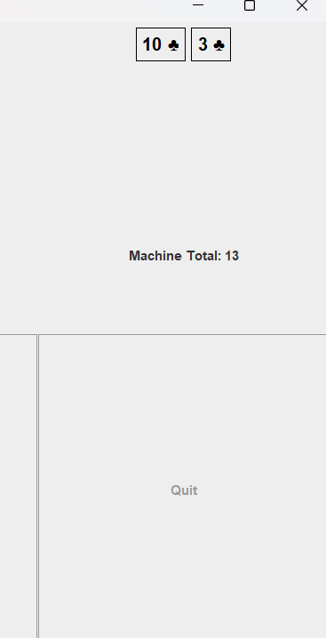

<h1>Project Java BlackJack</h1>

***

<h2>***BlackJack:***</h2>

In this version of the game, you must draw cards from the deck
to get as close as possible to a total of 21. You must not exceed
21, or you will lose.

Once you are done drawing cards, it is the machine's turn. The machine
also cannot exceed 21, or it will lose. When its total reaches 17 or 
higher, it is forced to stop drawing cards.

When both the player and the machine have finished their turns, the game 
determines the winner. The player with the total closest to 21 wins. If 
both have the same total, the result is a draw.

***

<h2>***How to play:***</h2>

Open the file Project-Java_BlackJack.jar to start the game.

Once the game is open, click on Start Game to begin playing.

It’s your turn! Click Continue to draw as many cards as you want.
Be careful not to exceed 21, or you will lose.

When you feel ready to stop, click Stop to pass the turn to the machine.
The buttons will be disabled, and the machine will start drawing cards.

The machine stops drawing cards once its total reaches 17 or higher.
If it exceeds 21, it loses. Otherwise, the game determines the winner 
based on the total closest to 21. If both totals are the same, the game 
ends in a draw.

When the game is over, it resets to the initial configuration, ready for a new round.

